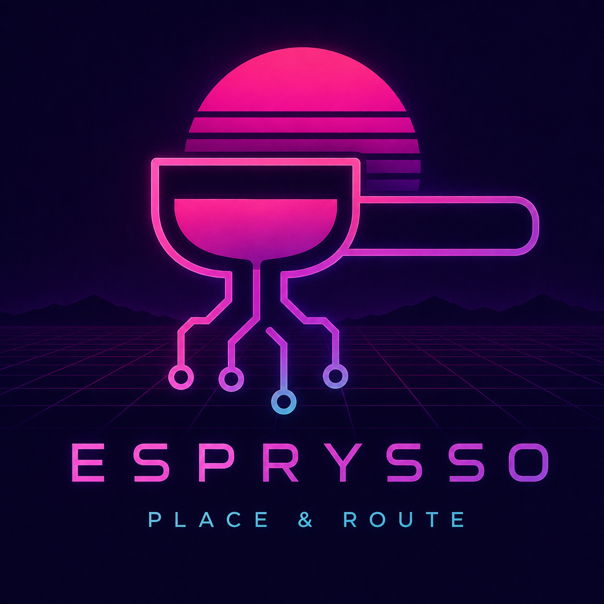

<p align="center">
  <!-- Replace docs/logo.png with your Esprysso logo -->
  
</p>

<h1 align="center">Esprysso</h1>

<p align="center"><em>A toy place-and-route tool — pulling a layout under pressure.</em></p>

<p align="center"><strong>Written in Julia.</strong></p>

---

## Overview

**Esprysso** is a toy place-and-route (P&R) tool built to learn how physical
design automation works. Given a gate-level netlist and a physical cell library,
a P&R tool decides *where* each cell goes on the die and *how* the wires between
them are routed, producing a physical layout that (ideally) meets area, timing,
and design-rule constraints.

This is a learning project, not a production tool. It's written in **Julia**
because P&R is half algorithms, half math — the analytic placement methods
(quadratic / force-directed) read almost like the equations, sparse solves and
array work are first-class, and multiple dispatch is a genuinely different way to
structure code around the many interacting entity types (cells, nets, grids,
obstacles).

## Status

🌱 **Very early.** No code yet. This repo currently exists to reserve the name
and capture intent. Expect it to sit quietly for a while before the first commit.

## Planned scope

- Read a gate-level netlist and a simplified cell library
- Floorplanning: rough placement of blocks and I/O
- Global and detailed placement of standard cells
- Global and detailed routing of interconnect
- Basic design-rule and connectivity checks
- Emit a layout in a simple, inspectable format

Nothing here is fixed — it's a sketch to aim at.

## Toolchain

- **Julia**
- Built-in **Pkg** for environment and dependency management (`Project.toml`)

Once there's code, the intended setup will look roughly like:

```bash
julia --project=.
# then, in the Pkg REPL (press ] ):
pkg> instantiate
```
---

*Part of a small suite of toy EDA tools built for learning.*
